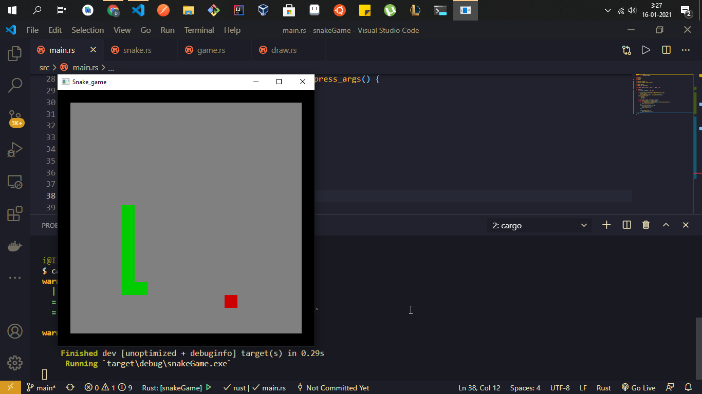

# Rust Snake Game

Simple snake game hecho en Rust.

* `cargo run` para ejecutar la app, `cargo build` para crear un archivo ejecutable

Puedes ver mi cuaderno de notas de Rust [aqui](https://github.com/Dieg0Code/Rustlang_notes) si quieres aprender Rust.

:v: :v: :v: